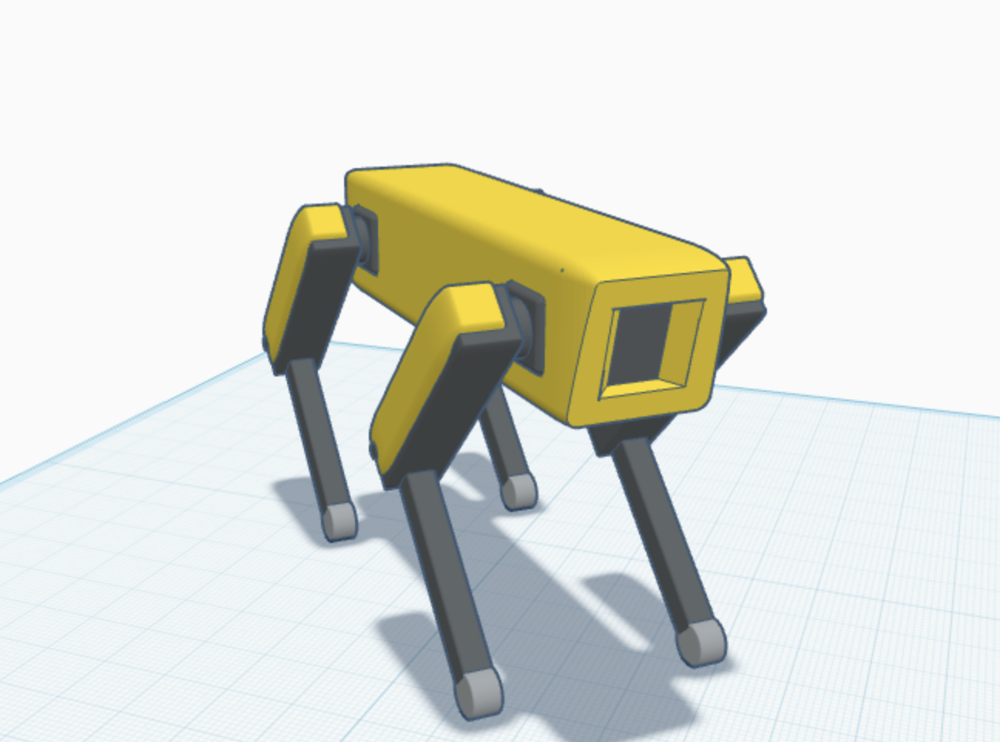
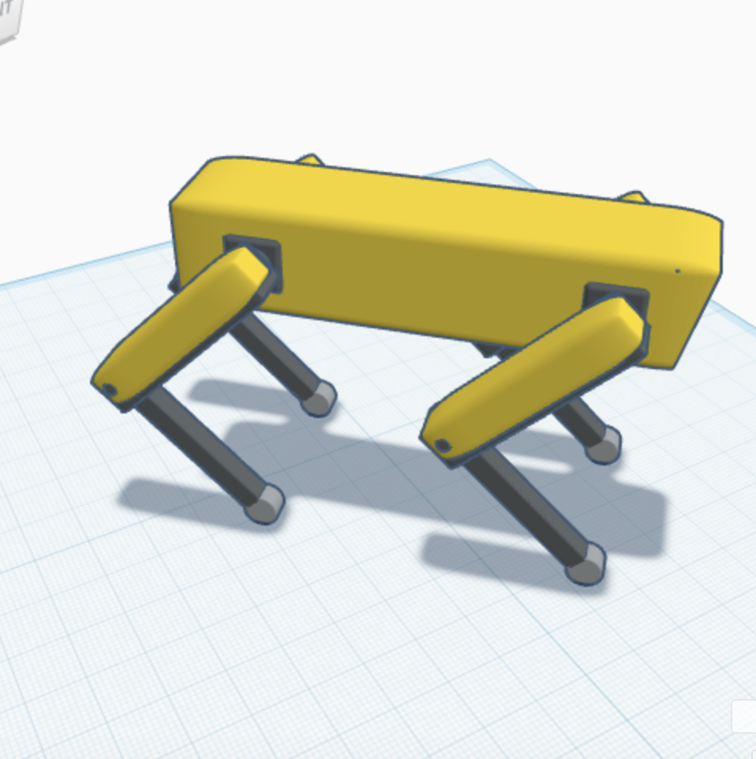

# Robotic Dog - Mechanical Design Project

This project is an initial mechanical design of a simple quadruped robotic dog, created using Tinkercad as part of the SmartMethods mechanical design task. The goal is not to build an advanced robot, but to understand and apply the core mechanical fundamentals that allow a robot to stand and walk.

---

## Body Shape and Structure

The main body is a rectangular block with a front sensor/camera cutout.

- Overall bounding box (full design, legs included): 95.3 mm (Length) x 95.3 mm (Width) x 61 mm (Height)
- Body height (above the legs): approximately 34 mm
- Body footprint at its widest cross-section: approximately 80 mm x 80 mm
- Material assumption: Lightweight rigid material (e.g., 3D-printed PLA)
- Shape rationale: A block-based body provides a flat, stable base and enough internal volume for future electronics (battery, controller board), with a front cutout reserved for a sensor or camera module

Note: measurements above were extracted directly from the exported STL file using cross-sectional analysis, not estimated.

---

## Leg Design

The robot has 4 legs, each built from two segments connected at a joint.

- Leg segment diameter: approximately 6.4 mm (radius approximately 3.2 mm)
- Leg length (from ground contact to body attachment point): approximately 27 mm
- Knee Joint: represented as the connection point between the thigh and shin segments

All 4 legs were built by designing one leg first, then duplicating and mirroring it to maintain symmetry around the body.

---

## Degrees of Freedom (DOF)

Each leg has 2 joints:

1. Hip Joint - moves the leg forward/backward
2. Knee Joint - bends the leg

| Item | Value |
|---|---|
| Joints per leg | 2 |
| Number of legs | 4 |
| Total DOF | 8 |

---

## Motor Selection

Motor type: Servo Motor - MG996R

Why this motor:
- Torque rating (approximately 10-11 kg·cm) covers the calculated requirement with a wide safety margin
- Widely available and low-cost
- Common choice for small hobby-robotics leg joints

---

## Initial Torque Calculation (Hip Joint)

Calculation for the hip joint, based on the actual measured leg length from the design:

```
Given:
  Mass on joint (m)   = 0.3 kg   (conservative assumption; final assembled
                                   weight with motors/battery/electronics
                                   will exceed the empty CAD shell weight)
  Arm length (d)      = 0.027 m  (actual measured leg length, ground to body)

Step 1 - Force:
  F = m x g = 0.3 x 9.81 = 2.943 N

Step 2 - Torque:
  tau = F x d = 2.943 x 0.027 = 0.0794 N路m ~= 0.81 kg路cm

Step 3 - Apply safety factor (x2):
  Required torque >= 1.62 kg路cm
```

Conclusion: The MG996R (11 kg路cm) provides a large safety margin above the calculated requirement for this joint.

---

## Stability and Center of Gravity

- The support polygon is the shape formed by the ground-contact points of the legs at any instant.
- For static stability, the robot's center of gravity must remain inside the support polygon at all times.
- With all 4 legs on the ground, the support base is a rectangle, which is highly stable.
- When one leg lifts during walking, only 3 contact points remain, and the center of gravity must stay inside the triangle formed by those 3 points to avoid tipping over.

---

## Proposed Gait: Wave Gait

The Wave Gait was chosen for this design:

- Only one leg moves at a time while the other three remain planted
- Slower than alternative gaits (e.g., Trot), but significantly more stable
- Best suited for a simple, initial mechanical design where stability matters more than speed

---

## Expected Mechanical Issues

| Issue | Description |
|---|---|
| Vibration | Occurs at foot-ground contact due to joint movement speed |
| Weight imbalance | If mass is not evenly distributed, the robot may tip |
| Insufficient torque | If actual load exceeds estimated load, motors may stall |
| Joint wear/friction | Repeated use increases wear at contact points |
| Structural flex | Cheap/flexible materials reduce leg rigidity and precision |

---

## Design Screenshots

Front / Isometric View



Rear View



---

## Repository Contents

- `robot_dog_design.stl` - 3D model exported from Tinkercad
- `images/` - Design screenshots (front-iso-view.png, rear-view.png)

---

## Tools Used

- Tinkercad - 3D modeling and mechanical layout
